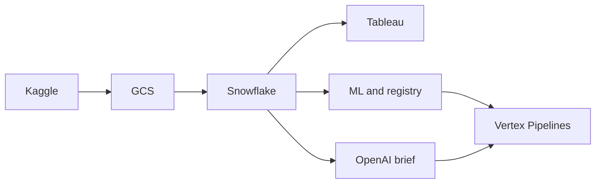

# Ecom AI Analytics

Automated analytics pipeline for Brazilian e-commerce (Olist-style) data: **Kaggle → GCS → Snowflake** (raw, staging, marts, tasks), **Tableau** refresh, **ML** (forecast + delay models on Vertex AI, drift and registry in Snowflake), and an **OpenAI** daily KPI brief stored in Snowflake. Optionally submits the same ML + brief graph to **Vertex AI Pipelines** (KFP) for managed runs.

## Pipeline

Single entrypoint from the repo root:

```bash
python pipeline/run_full_pipeline.py
```

| Step | Script | Description |
|------|--------|-------------|
| 1 | `ingest_kaggle_to_gcs.py` | Download dataset, extract to `data/raw/`, upload to GCS |
| 2 | `load_gcs_to_snowflake.py` | Load CSVs into Snowflake raw tables |
| 3 | `trigger_snowflake_tasks.py` | Run Snowflake tasks (staging → marts → KPIs) |
| 4 | `run_ml_local.py` | Train models (forecast/delay), Vertex Model Registry upload, drift + Snowflake registry |
| 5 | `generate_daily_client_brief.py` | KPIs from Snowflake → OpenAI → `MART.CLIENT_DAILY_BRIEF` |
| 6 | `run_vertex_ai_pipeline_job.py` | Submit compiled KFP template (only if `RUN_VERTEX_PIPELINE=true`) |
| 7 | `run_tableau_refresh.py` | Tableau REST: PAT sign-in, trigger extract/workbook refresh (runs **last**) |



## Repository layout

| Path | Purpose |
|------|---------|
| `pipeline/` | Orchestration and step scripts |
| `pipeline/components/` | Training logic, drift/registry, KFP component sources |
| `pipeline/ecom_vertex_pipeline.json` | Compiled KFP — forecast → delay → drift → brief |
| `pipeline/ecom_vertex_pipeline_llm_only.json` | Compiled KFP — brief only |
| `sql/` | Raw tables and load patterns |
| `snowflake_sql/` | Staging, marts, streams/tasks, features/registry |
| `.env.example` | Environment template (copy to `.env`) |
| `scripts/` | Cloud automation scripts (`sync_env_to_secrets.ps1`, `setup_cloud_scheduler.ps1`) |

## Requirements

- Python **3.11+**
- [Kaggle API](https://github.com/Kaggle/kaggle-api) credentials
- GCP project, GCS bucket, service account with **Storage** access and **Vertex AI User** (or equivalent) for ML upload
- Snowflake warehouse, role, and objects deployed from this repo’s SQL
- Tableau Server or Cloud: base URL, site content URL, PAT, workbook/datasource IDs as used by `run_tableau_refresh.py`
- OpenAI API key for the brief step

## Setup

```bash
git clone <your-repo-url>
cd ecom_ai_analytics
python -m venv .venv
pip install -r requirements.txt
cp .env.example .env
```

Edit **`.env`** with your credentials. Do not commit `.env`.

### Snowflake

Apply scripts in dependency order, for example:

1. `sql/01_create_raw_tables.sql`, `sql/02_copy_into_raw.sql` (or your equivalent)
2. `snowflake_sql/02_create_stage_tables.sql` → `03_create_mart_tables.sql` → `04_create_streams_tasks.sql` → `05_features_predictions_registry.sql`

Task names in `pipeline/trigger_snowflake_tasks.py` must match your `ECOM_ANALYTICS.OPS.*` tasks (or change the script to match your names).

### Run

From the **repository root** (directory that contains `pipeline/`):

```bash
python pipeline/run_full_pipeline.py
```

### Preflight checks

Run manually before long jobs:

```bash
python pipeline/preflight.py
```

It validates required env vars for enabled flags (`RUN_TABLEAU_REFRESH`, `RUN_VERTEX_PIPELINE`, etc.). Vertex runs additionally require **`VERTEX_PIPELINE_ROOT=gs://BUCKET/...`** or **`VERTEX_AI_GCS_STAGING_BUCKET=gs://BUCKET`** so ML upload steps can resolve a staging bucket.

### Environment flags

| Variable | Default | Effect |
|----------|---------|--------|
| `RUN_ML_TRAINING` | `true` | Set `false` to skip ML local training step |
| `RUN_LLM_BRIEF` | `true` | Set `false` to skip daily brief generation |
| `RUN_VERTEX_PIPELINE` | `false` | Set `true` to submit the Vertex pipeline job after ML + brief; set **`VERTEX_PIPELINE_TEMPLATE_PATH`** (GCS URI to compiled JSON), **`VERTEX_PIPELINE_ROOT`** (`gs://…/pipeline-root`), **`VERTEX_SERVICE_ACCOUNT`** (SA the workload runs as — avoid default compute SA), optional **`VERTEX_AI_GCS_STAGING_BUCKET`** (`gs://bucket` — if unset, bucket is taken from `VERTEX_PIPELINE_ROOT`), and optional **`VERTEX_PIPELINE_PARAMS_JSON`** (`{}` is fine) |
| `VERTEX_PIPELINE_WAIT_FOR_COMPLETION` | `true` | When `true`, `run_vertex_ai_pipeline_job.py` blocks until the remote pipeline succeeds or fails so later steps (e.g. Tableau) see finished Vertex outputs; set `false` to submit and exit immediately |
| `RUN_TABLEAU_REFRESH` | `true` | Set `false` to skip Tableau refresh (**runs last** after all other enabled steps) |

## Vertex AI (KFP)

Compile templates after changing `vertex_pipeline.py` or components:

```bash
python pipeline/vertex_pipeline.py
```

After every change to `pipeline/components/kfp_ml_components.py`, `pipeline/vertex_pipeline.py`, or related KFP sources:

1. `python pipeline/vertex_pipeline.py`
2. Upload **`pipeline/ecom_vertex_pipeline.json`** to GCS (overwrite the object referenced by **`VERTEX_PIPELINE_TEMPLATE_PATH`**), e.g. `gcloud storage cp pipeline/ecom_vertex_pipeline.json gs://YOUR_BUCKET/path/ecom_vertex_pipeline.json`

Then either set `RUN_VERTEX_PIPELINE=true` in the full pipeline or run:

```bash
python pipeline/run_vertex_ai_pipeline_job.py
```

Run from the **repository root** so `import pipeline` resolves (`pipeline/` on `PYTHONPATH`). That script waits for the pipeline run to finish by default (`VERTEX_PIPELINE_WAIT_FOR_COMPLETION=true`), which matches Tableau running **after** Vertex in `run_full_pipeline.py`. Use `VERTEX_PIPELINE_WAIT_FOR_COMPLETION=false` only when you want submit-and-exit behavior.

`VERTEX_PIPELINE_PARAMS_JSON` can be `{}`: the submitter merges `project_id`, `region`, **`vertex_gcs_staging_bucket`** (from **`VERTEX_AI_GCS_STAGING_BUCKET`** or derived from **`VERTEX_PIPELINE_ROOT`**), Snowflake fields, and `openai_api_key` unless overridden in JSON. The Vertex workload SA needs permission to write model artifacts under your staging bucket / `vertex-ai-staging/` prefixes.

Use a GCS template path containing `llm_only` for the LLM-only compile (so `project_id` / `region` are not sent).

## Production scheduling

Schedule the same command (`python pipeline/run_full_pipeline.py` from repo root) with **Cloud Scheduler**, **cron**, or your orchestrator. Inject secrets via **Secret Manager** or similar; use **workload identity** or `GOOGLE_APPLICATION_CREDENTIALS` for GCP.

### Cloud Scheduler automation scripts

This repo now includes two scripts for full hands-off deployment:

- `scripts/sync_env_to_secrets.ps1` — reads `.env` and creates/updates Secret Manager values (except runtime flags).
- `scripts/setup_cloud_scheduler.ps1` — builds image, creates/updates Cloud Run Job, IAM bindings, and Cloud Scheduler trigger.

Example:

```powershell
pwsh scripts/sync_env_to_secrets.ps1 -ProjectId your-gcp-project-id -EnvFile .env
pwsh scripts/setup_cloud_scheduler.ps1 -ProjectId your-gcp-project-id -Region us-central1 -Schedule "0 8 * * *" -TimeZone "Asia/Kolkata"
```

## Security

- Never commit secrets; rely on `.env` locally and managed secrets in production.
- Restrict service accounts to least privilege (GCS, Vertex, Snowflake roles as needed).

## Troubleshooting

| Issue | Check |
|-------|--------|
| No CSVs in `data/raw/` | Run ingest first; confirm `KAGGLE_*` and network |
| Snowflake failures | Warehouse, role, database `ECOM_ANALYTICS`, tasks and feature tables exist |
| Tableau 401 / failed refresh | PAT, site `contentUrl`, workbook/datasource IDs, embedded credentials if required |
| KFP compile errors | Run `python pipeline/vertex_pipeline.py` from repo root; see comments in `vertex_pipeline.py` about pipeline parameter types |
| Vertex `Model.upload` / invalid bucket | Set **`VERTEX_PIPELINE_ROOT=gs://bucket/prefix`** or **`VERTEX_AI_GCS_STAGING_BUCKET`**; ensure SA has Storage write on that bucket |
| Vertex “no supported model files” | Use latest compiled JSON on GCS; delay/forecast artifacts must expose **`model.joblib`** at artifact root |

## License

Add a `LICENSE` file when you publish this repository.
